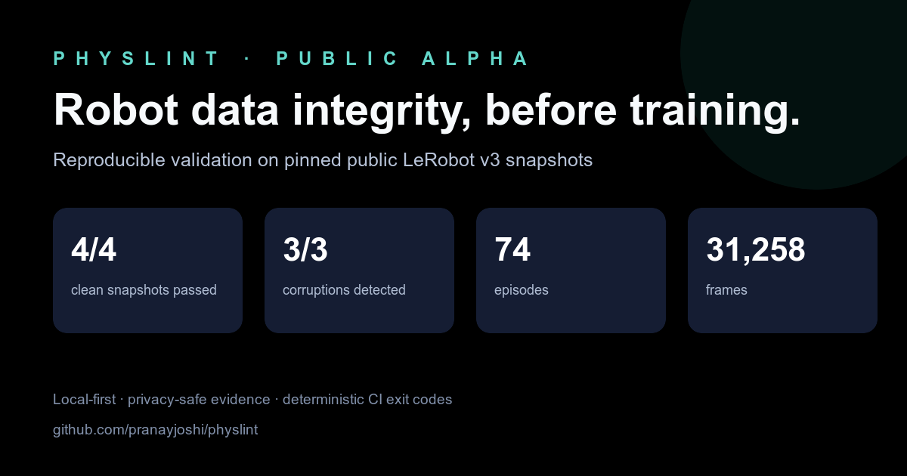
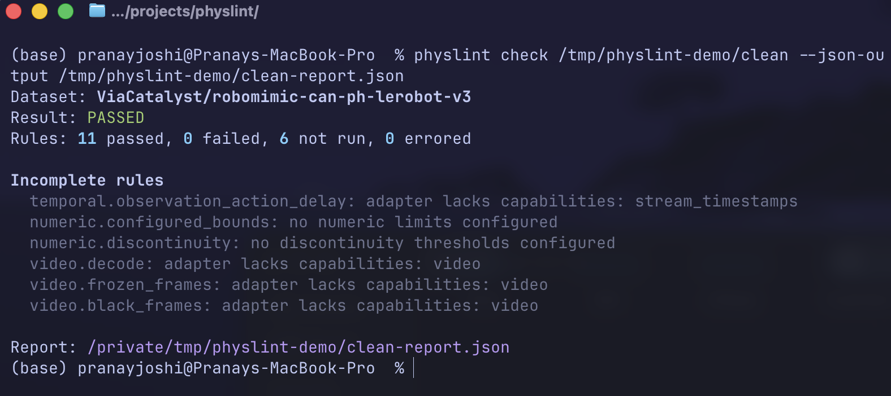
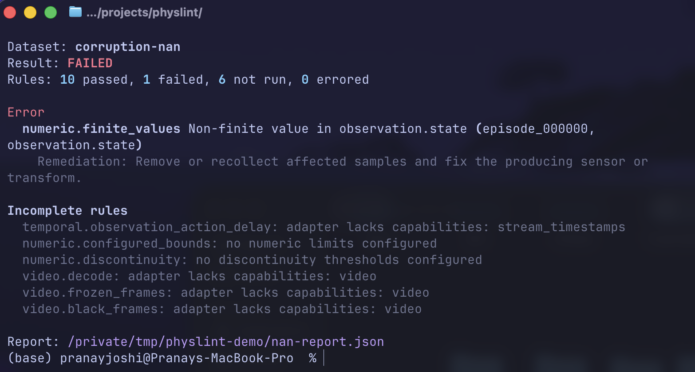

<div align="center">

# Physlint

### Robot data integrity, before training.

Local-first, deterministic validation for physical-AI recordings and robot-learning datasets.

[](https://github.com/pranayjoshi/physlint/actions/workflows/ci.yml)
[](https://github.com/pranayjoshi/physlint/releases)
[](https://pypistats.org/packages/physlint)

[](LICENSE)


[Quickstart](#quickstart) · [Demo](#see-it-catch-a-real-defect) · [Rules](#what-physlint-checks) · [Evidence](#reproducible-public-data-evidence) · [Observatory](#physlint-observatory) · [Roadmap](#format-roadmap) · [Contributing](#contributing)



</div>

Physlint finds concrete integrity defects before robot data reaches training. It explains the impact, identifies the affected episode and stream, recommends remediation, writes a stable JSON report, and returns a CI-safe exit code.

The released `0.1.0a1` public alpha supports **LeRobot Dataset v3.x**. The current `0.2.0a1` development line adds generic **MCAP** container validation and a **ROS 2-over-MCAP** semantic profile, backed by pinned public and controlled evidence. Native rosbag2 SQLite remains a conversion workflow for now.

> [!IMPORTANT]
> Physlint validates configured data-integrity contracts. A pass does not certify policy quality, task success, or robot safety.

## Why Physlint?

- **Catch failures before GPU time:** malformed manifests, broken episode ranges, reordered clocks, missing values, corrupt video, frozen cameras, and black frames become actionable findings.
- **Keep robot data local:** `physlint check` performs no network requests and never modifies its source dataset.
- **Get evidence, not a mystery score:** every finding includes a stable rule ID, severity, source location, observed condition, expected condition, impact, and remediation.
- **Use it in CI:** deterministic execution, versioned JSON, atomic report writes, strict configuration, and documented exit codes.
- **Trust scoped claims:** the public release gate pins exact dataset revisions and commits sanitized reports, corruption recipes, checksums, and publication metrics.

## Quickstart

Physlint requires Python 3.11 or newer.

### Install from PyPI

```bash
python -m pip install "physlint[video]==0.1.0a1"
```

To test the exact tagged source instead of the PyPI distribution, install the GitHub release directly:

```bash
python -m pip install "physlint[video] @ git+https://github.com/pranayjoshi/physlint.git@v0.1.0a1"
```

### Check a LeRobot dataset or MCAP recording

```bash
physlint inspect /path/to/lerobot-dataset
physlint check /path/to/lerobot-dataset

physlint inspect /path/to/recording.mcap
physlint check /path/to/recording.mcap

# Force ROS 2 semantics when an MCAP header does not declare the profile.
physlint inspect /path/to/recording.mcap --profile ros2
```

Write JSON to an exact destination:

```bash
physlint check /path/to/lerobot-dataset \
  --output json \
  --json-output artifacts/physlint-report.json
```

The source remains untouched. Exit code `0` means the configured contract passed; `1` means validation completed with a blocking finding.

## See it catch a real defect

These captures use the pinned Panda source from the release gate. The second dataset is a fully dereferenced copy with one deterministic NaN injected at episode 0, sample 5, state dimension 0.

<table>
  <tr>
    <th width="50%">Clean pinned snapshot</th>
    <th width="50%">Controlled NaN corruption</th>
  </tr>
  <tr>
    <td></td>
    <td></td>
  </tr>
</table>

Physlint owns NaN and infinity semantics in `numeric.finite_values`; the same sample is not duplicated as a missing-stream finding.

## What Physlint checks

Thirty-one deterministic rules are installed. Physlint plans only the rules for the detected adapter and profile:

| Area | Checks |
|---|---|
| **Manifest** | Required files, declared/stored schema agreement, required streams, and feature shapes |
| **Episodes** | Unique identifiers, positive lengths, non-overlapping boundaries, and stored-row agreement |
| **Temporal** | Strictly monotonic timestamps, FPS cadence, FPS-aware maximum gaps, complete stream overlap, and observation/action delay when independently timestamped |
| **Numeric** | NaN/Inf, configured physical bounds, and configured discontinuity limits |
| **Video** | Complete decode, motion-aware frozen-frame runs, and grouped black/near-empty frames |
| **MCAP** | Record/CRC readability, summary consistency, index coverage, channel/schema coherence, timestamp order, duplicate timestamps, and sequence continuity |
| **ROS 2** | Portable CDR schemas, full decode, required topics, cadence gaps, configured header/log skew, known message invariants, and TF parent consistency |

List or explain the installed rule contract:

```bash
physlint rules
physlint rules --json
physlint explain temporal.max_gap
physlint explain video.frozen_frames
```

Rules whose required inputs are unavailable return `not_run` with a reason; they are never misreported as passed. Robot-specific bounds and discontinuity checks stay `not_run` until the user supplies meaningful thresholds.

Read the complete [LeRobot MVP rules](docs/rules/mvp-rules.md) and [MCAP/ROS 2 rules](docs/rules/mcap-ros2-rules.md).

For ROS 2 contracts, configure the topics and timing assumptions that Physlint cannot infer honestly:

```yaml
config_version: 1
adapter: mcap
profile: ros2
fail_on: error
rules:
  ros2.required_topics:
    options:
      required_topics: [/joint_states, /tf, /camera/front/image_raw]
  ros2.topic_gaps:
    options:
      topic_rates_hz:
        /joint_states: 100
        /camera/front/image_raw: 30
      max_gap_multiplier: 5
  ros2.header_clock_skew:
    options:
      max_header_skew_ms: 25
```

## Configuration

Run `physlint init` to generate a documented quality contract, or create `physlint.yaml` yourself:

```yaml
config_version: 1
adapter: auto
required_streams:
  - observation.state
  - action
fail_on: error

rules:
  temporal.max_gap:
    options:
      # Default limit is 2× the interval implied by declared FPS.
      max_gap_multiplier: 2.0

  video.frozen_frames:
    options:
      max_consecutive_frames: 5
      # Action is preferred over noisier observed state by default.
      motion_streams: [action, observation.state]

  numeric.configured_bounds:
    options:
      limits:
        action:
          min: [-1.0, -1.0]
          max: [1.0, 1.0]

  numeric.discontinuity:
    options:
      max_delta:
        observation.state: [0.25, 0.25]

reports:
  json: true
  output_dir: .physlint/reports
```

Use it explicitly when needed:

```bash
physlint check /path/to/dataset --config physlint.yaml
```

Unknown top-level keys, rule IDs, rule options, duplicate required streams, and invalid values are rejected instead of silently ignored.

## CI integration

The CLI has stable exit codes and writes reports atomically, so a basic GitHub Actions gate is small:

```yaml
- name: Install Physlint
  run: python -m pip install "physlint[video]==0.1.0a1"

- name: Validate robot dataset
  run: |
    physlint check "$DATASET_PATH" \
      --json-output artifacts/physlint-report.json

- uses: actions/upload-artifact@v4
  if: always()
  with:
    name: physlint-report
    path: artifacts/physlint-report.json
```

| Exit code | Meaning |
|---:|---|
| `0` | Validation completed and the configured contract passed |
| `1` | Validation completed and the contract failed |
| `2` | Invalid command or configuration |
| `3` | Dataset or adapter failure |
| `4` | Internal Physlint error |
| `130` | Interrupted by the user |

## Reproducible public-data evidence

The alpha release gate evaluates four immutable public snapshots from four producers:

| Dataset | Robot | Episodes | Frames | Applicable rules | Result |
|---|---|---:|---:|---:|---|
| [`ViaCatalyst/robomimic-can-ph-lerobot-v3`](https://huggingface.co/datasets/ViaCatalyst/robomimic-can-ph-lerobot-v3) | Panda | 10 | 1,160 | 11 | Pass |
| [`cagataydev/scout-earth-rover-mini-20260616-053232`](https://huggingface.co/datasets/cagataydev/scout-earth-rover-mini-20260616-053232) | Earth Rover Mini | 3 | 4,176 | 14 | Pass |
| [`lerobot/svla_so101_pickplace`](https://huggingface.co/datasets/lerobot/svla_so101_pickplace) | SO-101 | 50 | 11,939 | 14 | Pass |
| [`vikram-avea/sentinel-demo-09`](https://huggingface.co/datasets/vikram-avea/sentinel-demo-09) | YAM humanoid | 11 | 13,983 | 14 | Pass |

Clean-source result: **4/4 snapshots pass with zero findings and zero rule errors.** Controlled-defect recall: **3/3** for a non-finite value, reordered timestamps, and a deleted source row.

Everything needed to audit or rerun those claims is versioned:

- [Pinned repository manifest](validation/manifest.yaml)
- [Deterministic corruption and execution harness](validation/harness.py)
- [Sanitized reports and SHA-256 values](validation/reports/real-data-2026-08-24/summary.json)
- [Publication-ready CSV](validation/reports/real-data-2026-08-24/summary.csv)
- [Manual classification and performance analysis](docs/validation/real-data-2026-08-23.md)
- [Reproduction instructions](validation/README.md)

Runtime measurements are observations from the documented machine and run—not universal performance guarantees.

The MCAP/ROS 2 release gate additionally verifies an exact Foxglove conformance fixture and two deterministic ROS 2 recordings:

| Recording | Profile | Provenance | Checks | Expected outcome |
|---|---|---|---:|---|
| Foxglove `TenMessages` conformance case | Generic MCAP | Public, revision-pinned | 7 | Timestamp-order and duplicate-time findings reproduced |
| JointState baseline | ROS 2 | Controlled recipe | 13 | Pass |
| JointState cadence + dimension corruption | ROS 2 | Controlled recipe | 13 | Gap and semantic findings reproduced |

See the [MCAP/ROS 2 manifest](validation/mcap_manifest.yaml), [reproduction harness](validation/mcap_harness.py), and [sanitized summary](validation/reports/mcap-ros2-2026-08-26/summary.json).

## Physlint Observatory

The repository now includes the first [Physlint Observatory](observatory/): a profile-aware public evidence index spanning LeRobot, MCAP, and ROS 2. It deliberately does not collapse unlike contracts into one universal quality score. Every row exposes provenance, applicable checks, findings, and a report link.

## Format roadmap

The storage format is an adapter boundary, not the product boundary.

| Format | Status | Intended mode |
|---|---|---|
| LeRobot Dataset v3.x | **Alpha—implemented and publicly validated** | Training datasets |
| Generic MCAP | **Alpha preview—implemented and validated** | Recording/container integrity |
| ROS 2 over MCAP | **Alpha preview—implemented and validated** | Topic/schema/semantic recording checks |
| Robomimic HDF5 | Planned | Demonstration datasets |
| RLDS/TFDS | Researching | Episode/step datasets |
| ROS bag2 SQLite and ROS 1 bag | Researching | Recordings |

MCAP support intentionally separates container/channel health from ROS 2 semantics. Training mappings from arbitrary topics to actions, state, cameras, and episode boundaries remain a later explicit profile. See the [cross-format roadmap](docs/roadmap.md) and [MCAP/ROS design](docs/design/mcap-ros.md).

Use the adapter-request issue form to contribute an immutable public example and a real failure mode.

## Current LeRobot boundary

Supported:

- LeRobot v3.x `meta/info.json` schema and path templates
- Chunked Parquet episode metadata and sample shards
- Multiple episodes per shared Parquet/MP4 file
- Fixed-size and regular vector features
- Shared video segments using per-camera timestamp ranges
- Metadata-first discovery and bounded batch iteration

Not currently supported:

- LeRobot v2.0/v2.1
- Remote Hub identifiers passed directly to `physlint check`
- Image-directory features in the video rule set
- Arbitrary codecs unavailable to the installed OpenCV build
- Inferred safety, calibration, task-success, or coordinate-frame conclusions

Read the [LeRobot adapter boundary](docs/adapters/lerobot.md).

## Current MCAP and ROS 2 boundary

Supported:

- Standalone MCAP files and directories containing exactly one MCAP file
- MCAP profile auto-detection plus explicit `generic` and `ros2` overrides
- CRC-aware single-pass scanning with bounded timing evidence
- Summary/statistics consistency, index coverage, schemas, timestamps, and sequences
- ROS 2 CDR decode using embedded `ros2msg` schemas without a ROS installation
- `JointState`, `Image`, `CompressedImage`, `/tf`, and `/tf_static` invariants
- User-defined required topics, expected rates, gap multipliers, and header/log skew

Not currently supported:

- Native rosbag2 SQLite `.db3`; Physlint returns conversion guidance
- Multi-file/split MCAP bag directories
- Custom message invariants beyond portable decode
- Automatic action/state/camera/episode training-semantic mappings
- Safety, calibration, task-success, or coordinate-frame correctness certification

Read the [MCAP and ROS 2 adapter boundary](docs/adapters/mcap-ros2.md).

## Design principles

```text
source format → read-only adapter → canonical episodes/streams → capability planner
                                                        ↓
                                           deterministic rule engine
                                                        ↓
                                      terminal + versioned JSON evidence
```

- **Read only:** source datasets are never repaired or rewritten.
- **Lazy by default:** metadata first, bounded Parquet batches, and one shared privacy-safe video analysis pass.
- **Explicit applicability:** adapters advertise capabilities; unavailable checks explain why they did not run.
- **Stable evidence:** rule versions, fingerprints, source revisions, and report schema are serialized.
- **Exception isolation:** one rule failure cannot masquerade as a clean dataset pass.

## Security and privacy

Validation is offline. Reports contain source references, timestamps, aggregate statistics, and targeted evidence—not embedded images or complete source samples. Treat every dataset parser as an attack surface and report suspected vulnerabilities privately through [GitHub Security Advisories](https://github.com/pranayjoshi/physlint/security/advisories/new).

See [SECURITY.md](SECURITY.md) before submitting a vulnerability. Do not attach private datasets or sensitive reports to public issues.

## Contributing

Contributions are welcome, particularly:

- Public healthy and defective datasets for adapter release gates
- False-positive reproductions
- MCAP/ROS recording schemas and failure modes
- New deterministic rules with controlled corruptions
- Documentation, performance characterization, and privacy reviews

Development setup:

```bash
git clone https://github.com/pranayjoshi/physlint.git
cd physlint
python -m pip install -e ".[video,dev]"

ruff check .
ruff format --check .
mypy
pytest
```

Rules require positive and negative fixtures, stable remediation, a bounded finding count, and controlled corruption evidence where applicable. Adapters must remain read-only, metadata-first, lazy over samples, and explicit about capabilities.

Read [CONTRIBUTING.md](CONTRIBUTING.md), open a format request, or join [GitHub Discussions](https://github.com/pranayjoshi/physlint/discussions).

## Project status

Physlint is an alpha. Its claims are deliberately limited to the documented LeRobot, generic MCAP, and ROS 2-over-MCAP boundaries and their committed evidence. The project does not train policies, repair data, host datasets, infer task success, produce an opaque quality score, or certify that a robot or policy is safe.

See [CHANGELOG.md](CHANGELOG.md) for release notes.

## License

Physlint is available under the [MIT License](LICENSE).
