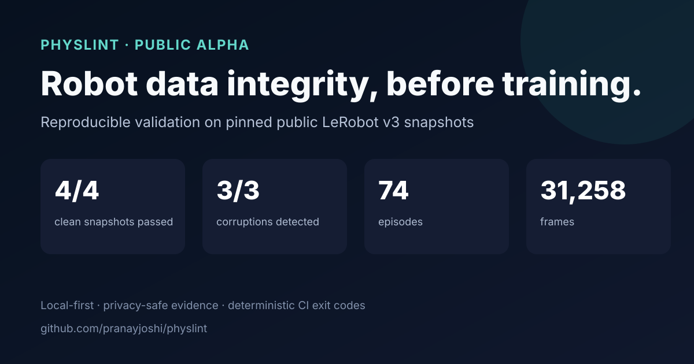

# Physlint

Physlint is a local-first, format-extensible integrity validator for physical-AI recordings and robot-learning datasets. It finds concrete defects before robot data reaches training, explains their impact, identifies the affected episode and stream, and returns a stable CI exit code.

The `0.1.0a1` public alpha ships with a production-tested adapter for **local LeRobot Dataset v3.x directories**. MCAP/ROS 2 recording validation and Robomimic HDF5 dataset validation are planned next. Physlint never modifies the source dataset and makes no network requests during a check.

## Validation evidence

The alpha release gate covers four immutable public repositories from four producers: 74 episodes, 31,258 frames, four embodiments, and six video streams. All four clean snapshots pass with zero findings or rule errors, while three independently generated corruptions are detected 3/3. The manifest, corruption recipes, sanitized reports, checksums, and publication CSV are committed under [`validation/`](validation/README.md).



These results characterize the tested LeRobot v3 boundary; they are not a claim that every physical-AI dataset is defect-free or that passing data guarantees a safe or successful policy.

## Format compatibility

| Format | Status | Intended mode |
|---|---|---|
| LeRobot Dataset v3.x | **Alpha—implemented and publicly validated** | Training datasets |
| MCAP with ROS 2 profiles | Planned—seeking design partners | Recordings and derived datasets |
| Robomimic HDF5 | Planned | Demonstration datasets |
| RLDS/TFDS | Researching | Episode/step datasets |
| ROS bag2 SQLite and ROS 1 bag | Researching | Recordings |

See the [cross-format roadmap](docs/roadmap.md) and [MCAP/ROS design proposal](docs/design/mcap-ros.md). Requests backed by public examples and real failure modes are welcome through the adapter issue template.

```console
$ physlint check /data/connector-insertion-v14
Dataset: connector-insertion-v14
Result: FAIL
Rules: 11 passed, 2 failed, 4 not run, 0 errored

Error
  temporal.max_gap Gap of 164.2 ms exceeds limit (episode_000042, timestamp)
  video.frozen_frames wrist_camera froze for 23 consecutive frames

Report: .physlint/reports/2026-08-23T143011Z.json
```

## Install

Physlint requires Python 3.11 or newer.

```bash
python -m pip install 'physlint[video]==0.1.0a1'
```

Until the alpha is published to PyPI, install the repository checkout with `python -m pip install -e '.[video]'`.

If an older environment reports `Repetition level histogram size mismatch` while reading episode metadata, check `python -c 'import pyarrow; print(pyarrow.__version__)'` and run `python -m pip install --upgrade 'pyarrow>=19.0.1'`. PyArrow 19.0.0 has a Parquet reader regression; the project declares the fixed minimum explicitly.

For contributors:

```bash
python -m pip install -e '.[video,dev]'
pytest
ruff check .
mypy
```

## Use

```bash
physlint inspect /path/to/lerobot-dataset
physlint check /path/to/lerobot-dataset
physlint rules
physlint explain temporal.max_gap
physlint init
```

`check` writes a versioned JSON report atomically. Use `--output json` for JSON on stdout, `--json-output PATH` for a specific report destination, or `--config PATH` for an explicit quality contract.

```yaml
config_version: 1
adapter: auto
required_streams: [observation.state, action]
fail_on: error
rules:
  temporal.max_gap:
    options:
      # Defaults to 2x the interval implied by the dataset FPS.
      max_gap_multiplier: 2.0
      # Set max_gap_ms for an explicit absolute override.
  numeric.configured_bounds:
    options:
      limits:
        action:
          min: [-1.0, -1.0]
          max: [1.0, 1.0]
  numeric.discontinuity:
    options:
      max_delta:
        observation.state: [0.25, 0.25]
reports:
  json: true
  output_dir: .physlint/reports
```

Unknown configuration keys, rule IDs, and rule options are rejected. A rule whose inputs are unavailable is reported as `not_run`; it is never reported as passed.

## Built-in rules

Seventeen deterministic rules are enabled by default:

| Area | Rules |
|---|---|
| Manifest | required files, schema agreement, required streams, shape consistency |
| Episode | unique identifiers, valid boundaries |
| Temporal | monotonic timestamps, sampling interval, maximum gap, complete stream overlap, observation/action delay |
| Numeric | finite values, configured bounds, configured discontinuity thresholds |
| Video | complete decoding, frozen-frame runs, black/near-empty frames |

Robot-specific bounds and discontinuity rules return `not_run` until thresholds are configured. Observation/action delay returns `not_run` unless separate `observation.timestamp` and `action.timestamp` features exist. Video rules return `not_run` for datasets without video capability. Frozen-frame findings require aligned robot motion, preferring action over observed state by default so stationary scenes and noisy sensors do not masquerade as camera failures.

## Exit codes

| Code | Meaning |
|---:|---|
| `0` | Validation completed and the contract passed |
| `1` | Validation completed and the contract failed |
| `2` | Invalid command or configuration |
| `3` | Dataset unreadable or adapter failure |
| `4` | Internal Physlint error |
| `130` | Interrupted by the user |

## Current LeRobot boundary

This alpha supports the v3 chunked layout: `meta/info.json`, Parquet episode metadata under `meta/episodes/`, Parquet samples under `data/`, and optional MP4 shards under `videos/`. It does not download Hub datasets, import the LeRobot/PyTorch runtime, support v2.1, or interpret arbitrary custom codecs. See [the adapter documentation](docs/adapters/lerobot.md).

## Non-goals

Physlint does not train policies, host datasets, repair source files, infer task success, calculate an opaque quality score, or certify that a robot or policy is safe. Passing means only that the configured integrity contract completed without a blocking finding.

## Security and privacy

Validation is offline. Reports contain source references, timestamps, and numeric evidence—not embedded images or full samples. Treat all dataset parsers as an attack surface and see [SECURITY.md](SECURITY.md) before reporting a vulnerability.

Licensed under MIT. Contributions are welcome; see [CONTRIBUTING.md](CONTRIBUTING.md).
